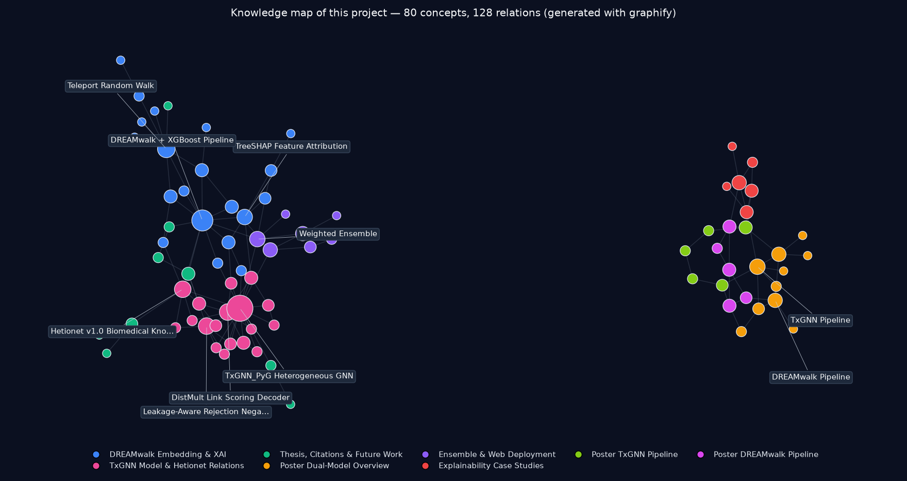
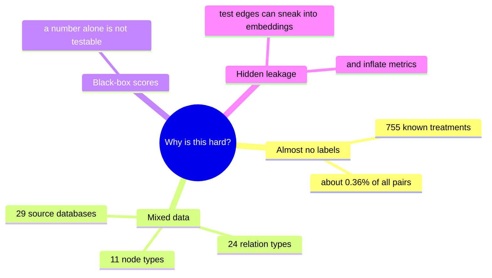
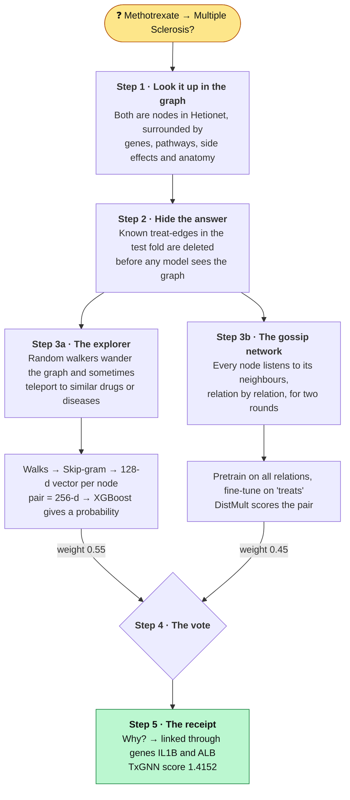
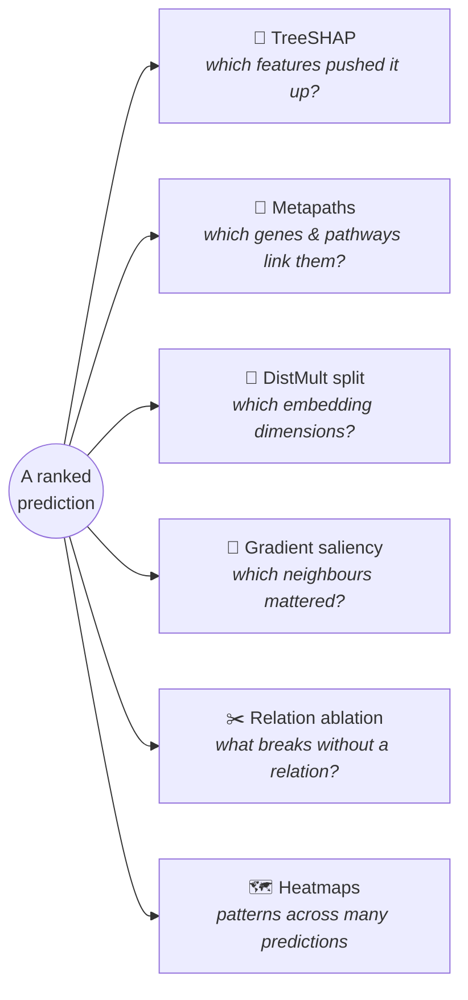
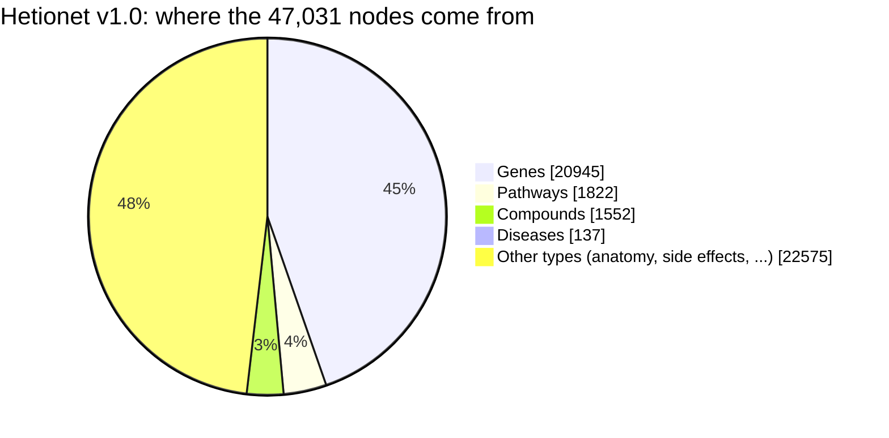
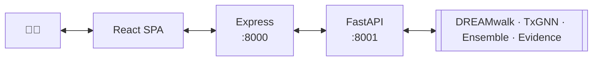
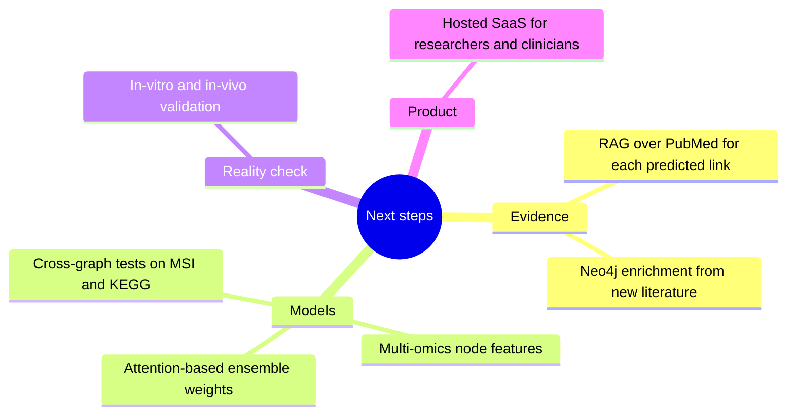

# 💊 Drug Identifier
### Giving approved drugs a second life with graph machine learning

**AUROC 0.9826** · 47k-node knowledge graph · two models, one verdict · every answer explained

---

## 🗺️ The project in one picture

Generated with [graphify](https://github.com/safishamsi/graphify) from the thesis, poster and slides in this repo. Pink = TxGNN, blue = DREAMwalk, purple = the ensemble and web app where the two meet.

---

## 🤔 The question

> *"This drug is already approved for something. Could it also treat **that** disease?"*

Repurposing an approved drug skips years of safety testing, because the dosing, side effects and manufacturing are already known. But there are about **212,000** possible compound–disease pairs, and only **755** of them are known treatments. Nobody can test them all in a lab. This project narrows that huge space down to a short list worth testing, and shows its reasoning for every entry.

---

## 🧪 How it works: following one prediction

Instead of listing components, let's follow a single question through the system:
**does Methotrexate treat Multiple Sclerosis?**

**Step 1: look it up.** Hetionet v1.0 is one big map of biomedicine: **47,031 nodes** and **2,250,197 edges** merged from 29 public databases. Methotrexate and Multiple Sclerosis are just two points on that map. Everything else around them is context the models can learn from.

**Step 2: hide the answer.** This step is easy to skip, and skipping it quietly breaks a lot of published pipelines. If the model could see the "Methotrexate treats X" edges it is being tested on, it would be cheating. So in **every fold**, the test treatment edges are removed *before* similarity, walks or embeddings are computed.

**Step 3a: the explorer (DREAMwalk + XGBoost).** Picture a walker hopping from node to node. Left alone, it would get stuck in the dense gene–gene network. So whenever it reaches a drug or disease, it can **teleport** to a semantically similar one, using similarity from vectorised Jaccard overlap and the ATC, MeSH and Disease Ontology hierarchies. The paths it takes are treated like sentences, and a type-aware **Skip-gram** turns them into 128-d vectors. A drug vector and a disease vector are joined into 256 numbers, and **XGBoost** (300 trees, depth 6) says how likely a treatment link is.

**Step 3b: the gossip network (TxGNN).** Here every node starts with a learnable 128-d vector and then *listens to its neighbours*. A gene hears from the pathways it belongs to, a drug hears from the genes it binds, and so on, with a separate `SAGEConv` for each relation type, stacked in two `HeteroConv` rounds. It first learns the whole graph, then specialises on "treats" edges. Negatives are drawn so that a real treatment is never mislabelled as a non-treatment. A **DistMult** decoder turns the two final vectors into a score.

**Step 4: the vote.** The two models learn in very different ways (where walkers end up vs. what neighbours say), so they make different mistakes. Their scores are blended **55 / 45**. A pair that both of them rank highly is a much safer bet.

**Step 5: the receipt.** A score is not enough for a scientist. The system also explains *why*. For Methotrexate → Multiple Sclerosis, the link runs through the genes **IL1B** and **ALB**. That is a hypothesis you can take into a lab.

---

## 🔍 Six ways to ask "why?"

The first two explain the XGBoost model and the last four explain TxGNN. Explanations use real names, never raw node IDs, and when two methods disagree you see both answers. One more example: **Etoposide → Breast Cancer** produces a SHAP force plot with **f(x) = 8.07**.

---

## 📊 What's inside the graph

Compounds and diseases, the two things we actually care about, make up only a small part of the graph. Most of what the models learn comes from everything *around* them.

---

## 🏁 Scorecard

```mermaid
xychart-beta
    title "Leak-free cross-validation (higher is better)"
    x-axis ["AUROC", "AUPR", "Accuracy"]
    y-axis "score" 0.80 --> 1.00
    bar [0.9826, 0.9869, 0.9342]
    bar [0.9396, 0.9378, 0.8775]
```

- 🟦 **TxGNN** (5-fold): AUROC **0.9826**, AUPR **0.9869**, accuracy **0.9342**. It was also compared against RGCN, DistMult and MLP baselines on the same harness.
- 🟩 **DREAMwalk + XGBoost** (10-fold): AUROC **0.9396**, AUPR **0.9378**, accuracy **0.8775**. That is almost identical to the original paper (0.938 / 0.939 / 0.873), even under the stricter leak-free protocol.
- 🧠 Full case studies on **Alzheimer's disease** and **breast carcinoma** are in the thesis.

---

## 🖥️ Using it

A researcher types a drug or disease into a **React** web app and picks a model (DREAMwalk, TxGNN or the ensemble). The request goes through a **Node.js / Express** gateway on port `8000`, which validates it, and then to a **FastAPI** inference service on port `8001`, which runs the models and the evidence pipeline. The researcher gets back a ranked list, the supporting evidence and an interactive graph. A built-in **XAI assistant** answers follow-up questions like *"why is this drug ranked first?"*

---

## 🔭 What's next

---

## 📚 Read more

- 📄 [**Full thesis**](./AI_Driven_Drug_Repurpose.pdf): methods, experiments and case studies
- 🖼️ [**Poster**](./AI_Drug_Repurposing_Poster%20.pdf): the whole project on one page
- 📊 [**Slides**](./AI-Driven%20Drug%20Repurposing%20final.pptx): presentation deck

## 🙌 Credits

Built by **Prince Mehra** for the Digilians 9-Month Diploma in Applied AI and Data Analytics (Military Technical College, August 2026).

<b>References</b>

1. Bang, D., Lim, S., Lee, S., & Kim, S. (2023). Biomedical knowledge graph learning for drug repurposing by extending guilt-by-association to multiple layers. _Nature Communications_.
2. Huang, K., & Zitnik, M. (2024). A foundation model for clinician-centered drug repurposing.
3. Zeng, X. et al. (2019). deepDR: a network-based deep learning approach to in silico drug repositioning.
4. Wang, Y. et al. (2022). DrugRepo: repurposing drugs based on chemical and genomic features.
5. Amiri, Razmara, Parvizpour & Izadkhah (2023). IDDI-DNN: drug repurposing via drug–disease association data integration using CNNs.
6. Talevi, A., & Bellera, C. (2020). Drug repurposing strategies, challenges, and opportunities.

⚠️ Predictions are computational hypotheses meant for lab follow-up. They are not medical advice.
